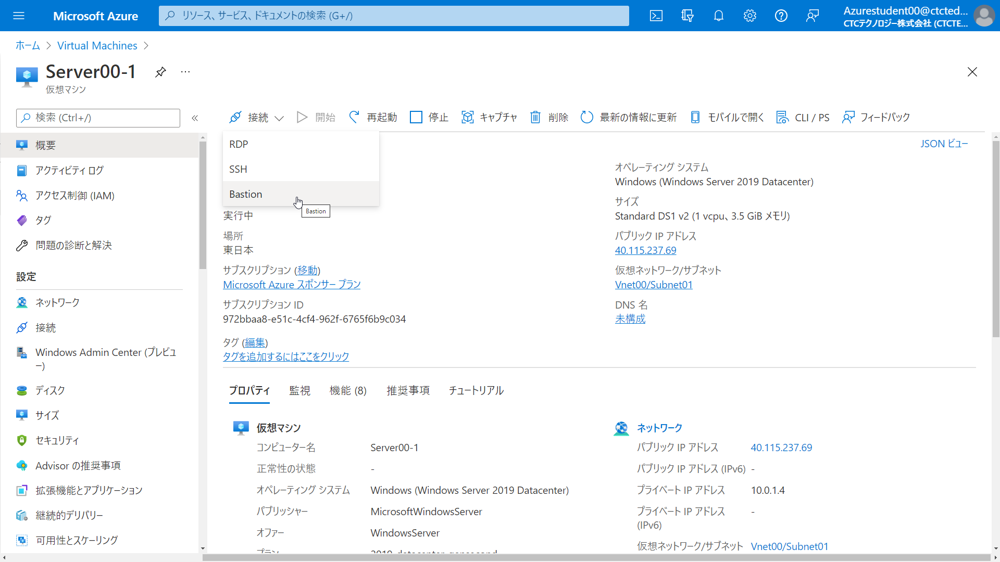
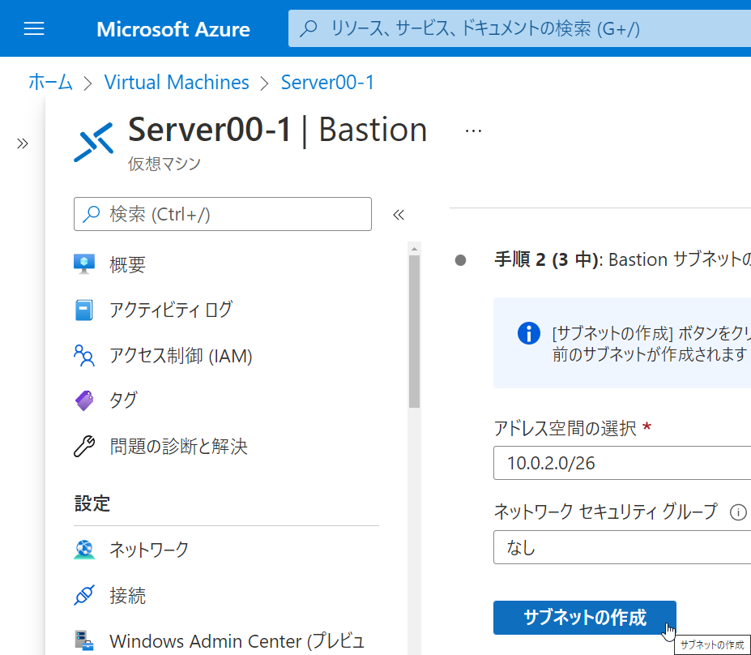
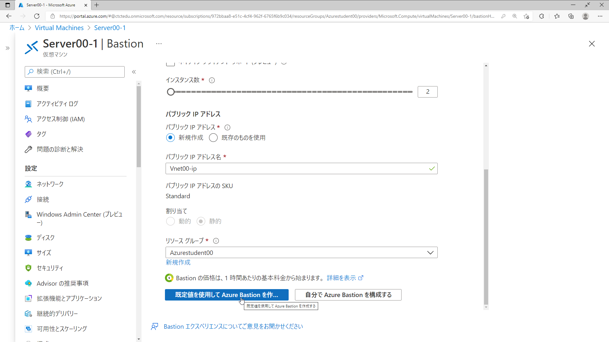
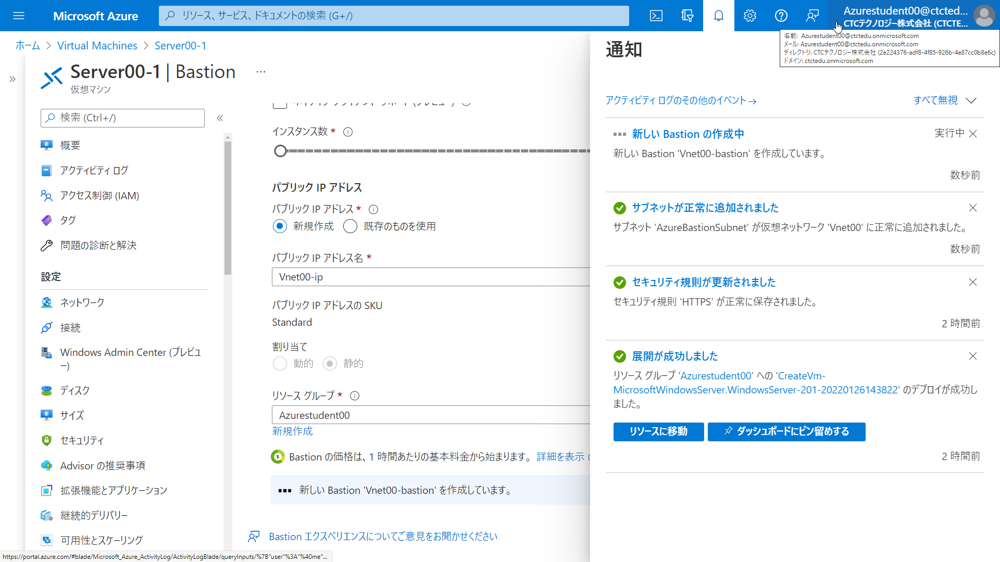
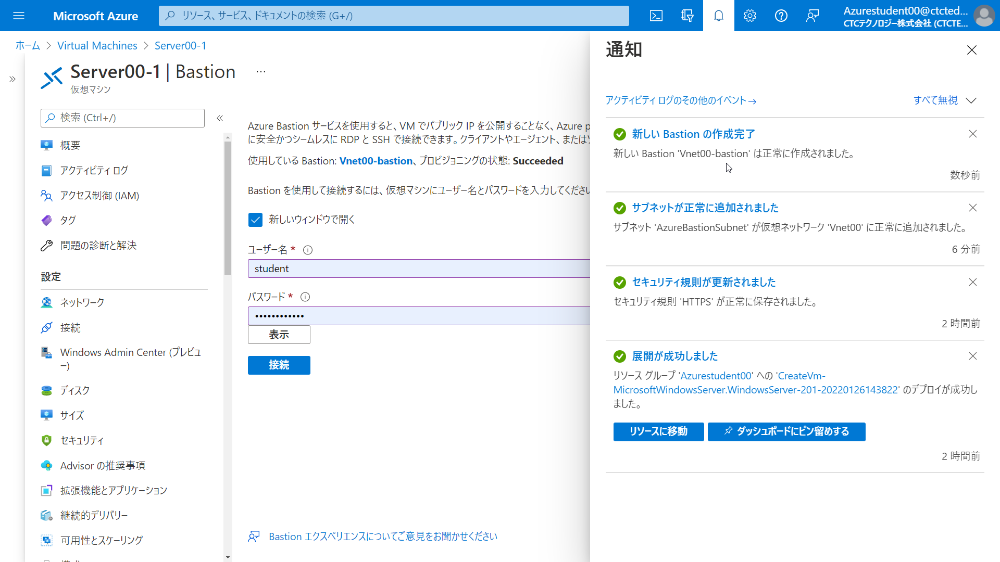
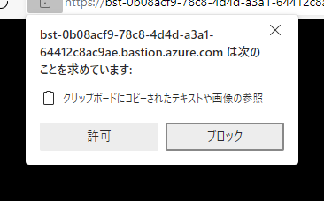
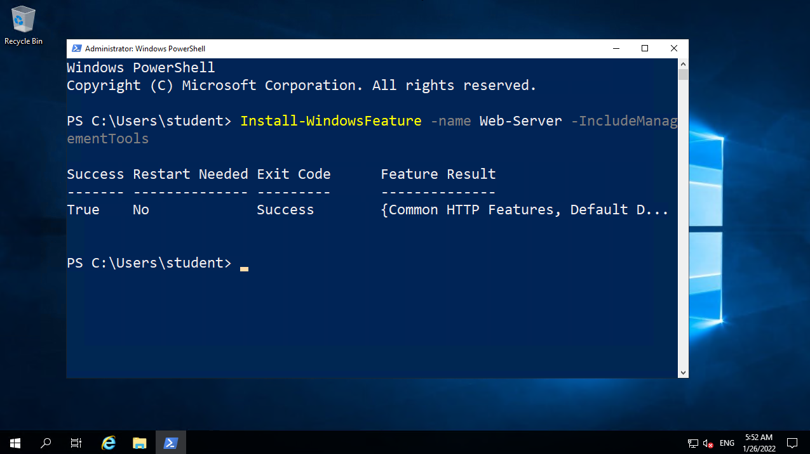

---
lab:
    title: 'Lab1 仮想マシンを作成する	'
    learning path: '02'
    module: 'Module2 Azureのコアサービス'
---

### タスク 2 - 仮想マシンに「Bastion 接続」でアクセスする

> **注：この手順は作成した仮想マシンにBastion接続する手順です。**
>
> **注：Bastion 作成は約 10 分掛かります。「演習2_App Serviceの作成」の実施も指示されている場合は、Bastion設定中に平行して実施してください。**

1. 仮想マシンブレードで「**接続**」を選択し「**Bastion**」を選択します。

    

    

2. 手順 2 では何も変更せずに「**サブネットの作成**」を選択します。

    

    

3. 手順 3 では何も変更せずに「**規定値を使用して Azure Bastion を作成する**」を選択します。

    

    

3. 画面右上の通知ボタンから「新しい Bastion の作成中」と表示されます。作成まで約 10 分待ちます。

    > 注：並行して「演習2_App Serviceの作成」を実施することを推奨します。(演習②は約 10 分の演習です)
    
    
    
    
    
5. 作成完了の通知を確認し、もう一度 Bastion の画面に移動します。

    

    

6. ユーザー名とパスワードを入力し、「接続」を選択します。

    | 設定       | 値               |
    | ---------- | ---------------- |
    | ユーザー名 | **student**      |
    | パスワード | **Pa$$w0rd1234** |

    > 注：「**新しいウィンドウで開く**」にチェックを入れている場合、ポップアップブロックが発生します。 
    >
    > 　　ポップアップブロックを許可し、再度「接続」を選択するか、チェックを外してください。

    

    

7. 「Bastion.azure.com が次の許可を求めています」と表示されますので、「許可」を選択してください。 

    > 注：Web ブラウザーに対してのクリップボード許可を設定しています。

    

    

8. Web ブラウザーで Windows Server の画面が表示されます。

    

    

9. Windows Server のデスクトップ画面が表示されます。初期設定で以下の項目が表示されます。「YES」を選択します。

    > 注：この設定は演習には影響しません。

    

    

6. Server Manager が自動で起動しますが、全て「×」で閉じます。


### タスク 3 - Internet Information Services (IIS)をインストールする

1. スタートメニューから「**Powershell**」を起動します。

   

   

2. 起動した Powershell で以下のコマンドを実行してください。

   ```powershell
   Install-WindowsFeature -name Web-Server -IncludeManagementTools
   ```

   > 注：これはIIS をインストールするコマンドです。

   

   

3. IS のインストールが開始されます。100%になるまで待ちます。

   

   

4. . IIS のインストールが完了し Exit Code が「**Success**」になったことを確認してください。

   

   

5. Web画面を最小化してください。

     

### タスク 4 - IIS のサンプルページに Web ブラウザーからアクセス

1. . Web ブラウザーを起動してください。

   > 注：ブラウザーはどれでも可能です

   

2. アドレスバーに「**http://仮想マシンのパブリック IP アドレス**」を入力してください。

   > 注：タスク2-19でメモしたパブリックIPアドレスです。
   >
   > 注：例としては http://11.22.33.44 などになります。

   

   

3. IIS のサンプルページが表示されます。

   


これで仮想マシンの構築とIISを構築し、Webサーバーを公開することができました。

演習は終了です。お疲れ様でした。
