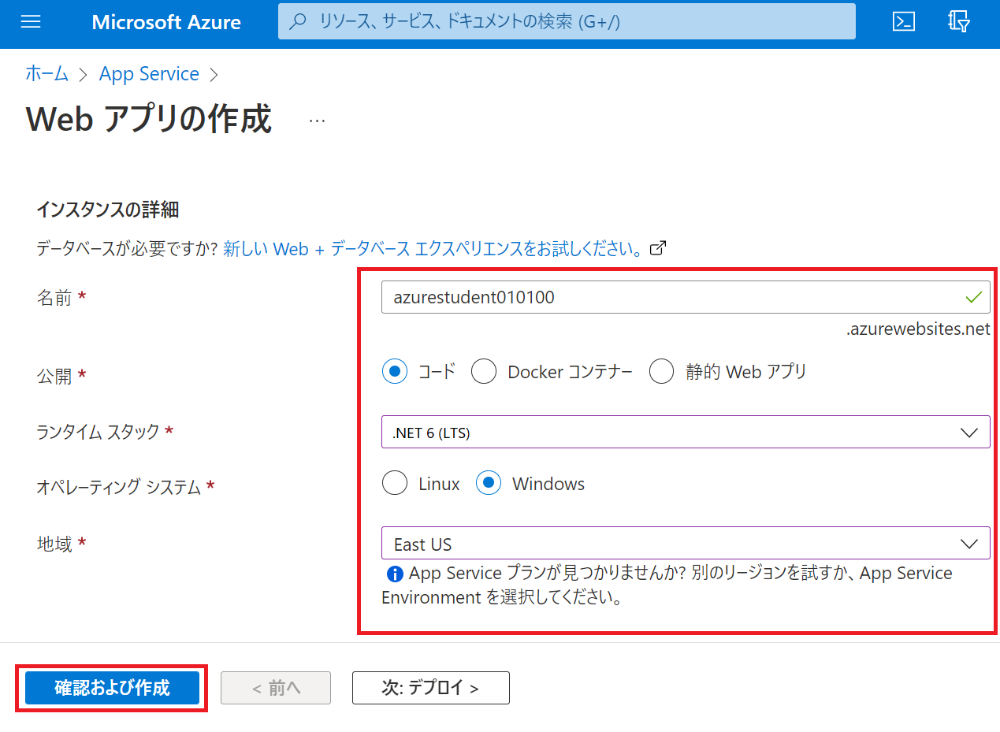

---
lab:
    title: 'Lab2 Webアプリを作成する	'
    learning path: '02'
    module: 'Module2 Azureのコアサービス'
---

# ラボ 02: Webアプリを作成する

## ラボ シナリオ

あなたの会社では、Azure上で新規にWebアプリを公開する予定です。Azure App Serviceを使い、Webページを公開します。


#### 推定時間: 10 分

## 演習 1 - Azure App Service から「Webアプリ」を作成

### タスク 1 - Webアプリを作成する

1. [https://portal.azure.com](https://portal.azure.com) に講師から指示された ID とパスワードでサインインします。

     | 設定       | 値                                         |
     | ---------- | ------------------------------------------ |
     | ユーザー名 | **azurestudent##@ctctedu.onmicrosoft.com** |
     | パスワード | Pa55w.rd1234                               |

     > 注：##は受講番号です。01 ～ 99の数字が入ります。

     

     

2. ポータルメニューの検索バーに「**app service**」と入力して検索結果を選択してください。

     

       

3. 画面右上の「**+作成**」を選択してください。

     

     

4. App Serviceの作成画面が表示されます。「**プロジェクトの詳細**」を入力します。

     | 設定               | 値                                    |
     | ------------------ | ------------------------------------- |
     | サブスクリプション | **Microsoft Azure スポンサー プラン** |
     | リソースグループ   | **AzureStudent##**                    |

     > 注：##は受講番号です。01 ～ 99の数字が入ります。
     >
     > 注：リソースグループがない場合は、「新規作成」を選択し、作成します。

     

     

5. 「**インスタンスの詳細**」を入力します。

     | 設定               | 値                     |
     | ------------------ | ---------------------- |
     | 名前               | **azurestudent$$$$##** |
     | 公開               | **コード**             |
     | ランタイムスタック | **.NET 6(LTS)**        |
     | 地域               | **East US**            |

     > 注：$$$$は今日の日付4桁を入力します。 (例：2022年1月1日  ⇒ 0101)
     >
     > 注：##は受講番号です。01 ～ 99の数字が入ります。(例：azurestudent010101)

     

     

6. 「**APP SERVICE プラン**」は何も変更せず、「**確認および作成**」を選択します。

     

7. 「検証に成功しました」と表示されたら、画面左下部の「**作成**」を選択します。

     

     

8. 1分ほどでApp Serviceの作成が完了となります。

     

       

9. デプロイ完了後、「リソースに移動」を選択してください。

   
   
     


### タスク 2 - サンプルのWebページを確認する

1. App Serviceブレードの画面右にある「**URL**」をクリックします。

   

   

2. サンプルのページが表示されます。

   
   
   

### タスク 3 - Webアプリを実装する

1. App Serviceブレードの左側にある**開発ツール**項目の「**App Service Editor(プレビュー)**」を選択し「**移動**」を選択します。

    

   

2. エディタが表示されます。「**hostingstart.html**」を**右クリック**し「**Delete**」を選択し削除します。

   
   
   

5. 画面左側にある「**Git**」アイコンを選択します。

   
   
   
   
5. 「**Repository URL**」に以下のURLを入力し「**Clone from a git URL**」を選択します。

   ```
   https://github.com/ctct-edu/ctc-travel-agency.git
   ```
   
   > 注：このURLは「Github」上に公開しているサンプルのリポジトリになります。
   >
   > 　　GitHub上にあるWebアプリのデータを自分のApp Service上にコピーし実装することが可能です。
   >
   > 　　試しにURLにアクセスすると、GitHubのページが表示されます。
   
   
   
   
   
5. リポジトリがコピーされました。画面右側の最終行で「**remote : Tolal ～**」と表示されます。

   
   
     

### タスク 4 - 更新されたWebページを確認する

1. App Serviceブレードに戻り、画面右にある「**URL**」をクリックします。

   

   

2. サンプルのページが表示されます。


これでApp Serivceを使い、Webページを公開することが出来ました。

演習は終了です。お疲れ様でした。
